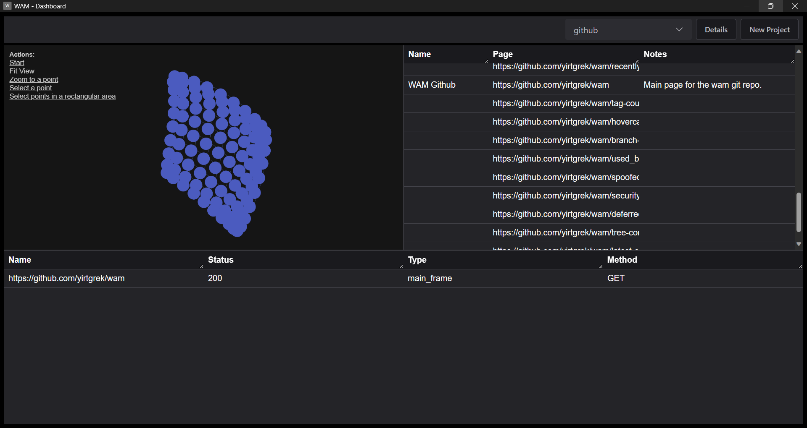

# WAM - Web App Mapper
WAM is a browser extension for Chrome, Edge, and Firefox that enables bug bounty hunters and security professionals to audit web applications. 

## Goals
Easy Install: To get started all you need to do is install a browser extension and off you go. No configuring proxies, installing desktop apps, or messing with settings.

Easy to Use: WAM should be easy to use and provide useful features such as web request capture, inspect request/responses, and replay + edit requests.

Useful Visualizations: WAM provides a network digram that allows you to easily identify and map the inner workings of large complicated web apps. The aim of this is to surface unique insights that would otherwise be hard to spot just looking at request logs.

## Why a Web Extension?
Browsers have grown a lot since apps like Burp and ZAP were first created. Many web apis have opened up and you can do a lot of what these apps do directly in the browser without the need to install full desktop proxies. 

The browsers developer tools are quite good and gets you 70% of the way there but the UX quickly gets out of hand since nothing is saved and you can't search old requests or save what you did before. 

WAM provides these nice quality of life features on top of the raw browser tool experience by saving state and presenting all the information in an oraganized searchable manner.

We aim to be middle ground between raw dogging app inspection with chrome dev tools and installing full proxy toolkits such as Burp, Caido, or Zap.

## Alternatives
The following are full featured alternatives to **WAM** that offer Web Security Auditing Toolkits but require installing and setting up software. 

**[Burp](https://portswigger.net/burp)**: Burp Suite is the gold standard in this space. They offer **Burp Suite Community** Edition for free with basic features similar to what **WAM** provides. You can pay for for **Burp Suite Professional** or **Burp Suite Enterprise Edition** to get a lot of advanced features and plugins.

**[ZAP](https://github.com/zaproxy/zaproxy)**: The **Zed Attack Proxy (ZAP)** started as an OWASP backed project that aims to be an open source version of **Burp**. It offers a lot of similar features as **Burp Suite Professional** but it's free and the code is open source. While it does a good job it falls a little short from capturing all of **Burps** features and the interface can feel dated. It's a solid option if you're looking for a quality free app scanner and proxy.

**[Caido](https://github.com/caido/caido)**: **Caido** is the new player on the block. While both **Burp** and **ZAP** are written in Java Caido is written in Rust for speed and has a modern interface. It's currently in rapid development and Public Beta but it's quickly catching up in features and even adding some features not availble in **Burp** or **ZAP**.